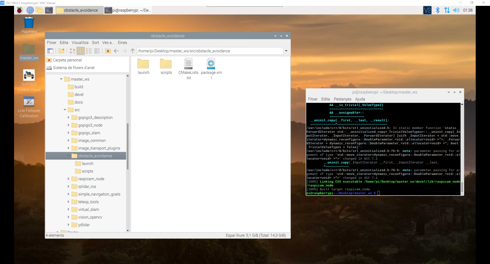
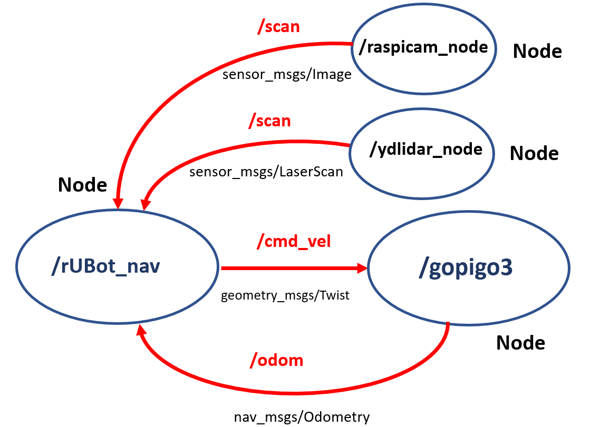
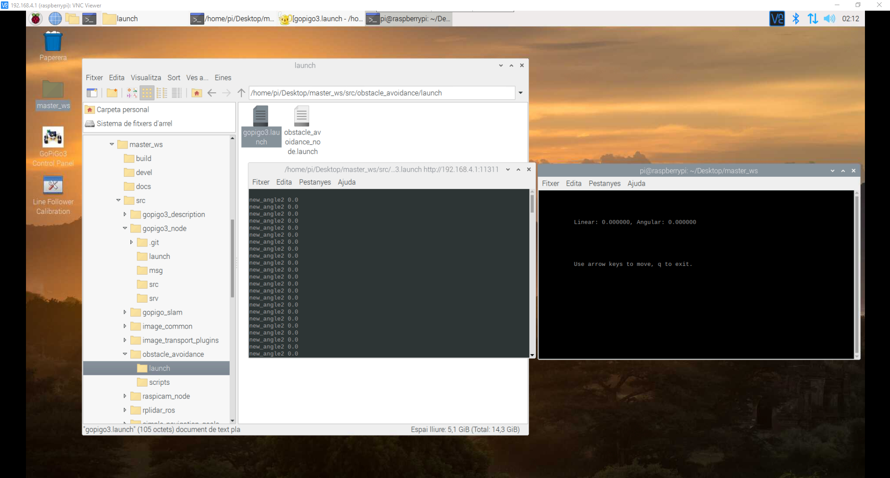

# **rUBot mecanum in Raspberrypi4 Setup&Control**

The main objectives are:
- Assemble a real robot (rUBot mecanum)
- Setup the HW drivers in raspberrypi4
- Control the rUBot movementj


%et's see how to fulfill these objectives
## **1. rUBot assembling**

This tobot prototype is based on:
- Mecanum wheel chasis:
- On-board Raspberrypi4
- Arduino mega: for HW driver control
- Arduino motor driver shield TB6612FNG:
  - https://es.aliexpress.com/item/4001086592215.html?spm=a2g0o.productlist.0.0.55da155eRs0f1N&algo_pvid=523f34f9-da3e-4a7e-bcbd-927dc560fb14&algo_exp_id=523f34f9-da3e-4a7e-bcbd-927dc560fb14-40
  - https://github.com/Seeed-Studio/Grove_Motor_Driver_TB6612FNG
- RaspiCAM RGB camera
- rpLIDAR sensor


## **2. Setup the HW drivers in raspberrypi4**
The raspberrypi4 onboard is preinstalled with:
- Ubuntu 20 server 32bits
  - NoMachine remote desktop
- ROS Noetic
- rubot_rbpi4_ws repository is located in /home/pi/Desktop folder 

### **2.1. Install Ubuntu 20 server 32bits**

Follow the steps in order to properly install the Raspberrypi:

- Install Raspberry Pi OS using Raspberry Pi Imager (download for windows): https://www.raspberrypi.org/software/
- Run the application and save the image:
  - Ubuntu --> Ubuntu 20 server 64bits to the SD card


- Insert the SD in a RBPi board and connect it to screen and ethernet cable to the router
- power the raspberrypi4 and login:
  - login: ubuntu
  - password: ubuntu
- You will have to change the password (we use ubuntu1234)

**Install Ubuntu Desktop**

In the terminal, type:
```shell
sudo apt-get install ubuntu-desktop
```
After some minutes, the desktop is installed. 

Type:
```shell
reboot
```
You will get the ubuntu 20 desktop

- choose a wifi network and change the timezone, language and password

**Install nomachine remote desktop**

Download nomachine in RaspberryPi and PC:
- In raspberryPi:
  - Download the version ARMv8 DEB in: https://www.nomachine.com/download/linux&id=29&s=Raspberry
  - open a terminal and install following the instructions
- In PC: https://www.nomachine.com/

**Notebook visualization in raspberrypi**

Use the NBviewer program from Jupyter:

https://nbviewer.ipython.org/

### **2.2. ROS Noetic Desktop installation**

Follow the instructions on: http://wiki.ros.org/noetic/Installation/Ubuntu
> Is recommended to upgrade first:
```shell
sudo apt upgrade
```
### **2.3. RaspberryPi4 install Access Point**

Follow instructions in: https://www.diyhobi.com/install-wifi-hotspot-raspberry-pi-ubuntu-mate/

The raspberrypi4 is configured:
- to generate a hotspot "rUBot_xx"
- NoMachine activated 
- raspicam activated 

When powering the raspberrypi3, generates a hotspot you have to connect to:
- SSID name: rUBot_10 
- password "rUBot"

Once you are connected to this network you will be able to connect your computer to the raspberrypi4 using NoMachine viewer:
- In PC open NoMachine viewer
- Select the raspberrypi IP address: 192.168.4.1
- you have to specify:
    - user: ubuntu
    - password: ubuntu1234
- You will have the raspberrypi4 desktop on your windows NoMachine screen


### **2.4. Create your workspace**

We will create the workspace where we will install all needed packages for our Hardware project
```shell
mkdir -p ~/Desktop/rubot_rbpi4_ws/src
cd ~/Desktop/rubot_rbpi4_ws/
catkin_make
echo "source ~/Desktop/rubot_rbpi4_ws/devel/setup.bash" >> ~/.bashrc
```
We will install:
- Raspberrypi camera
- rpLIDAR
- Arduino board with rosserial
### **Install raspberrypi camera**
You need to activate the raspicam in Ubuntu:
- open the file config.txt
```shell
sudo nano /boot/firmware/config.txt
```
- add the magic line start_x=1 at the end


- reboot
- update your system to install the necessary drivers:
```shell
sudo apt update
sudo apt upgrade
```
Now we will install the python module for picamera:
```shell
sudo apt install python3-pip
pip install picamera
```
And the needed libraries for raspicam package:
```shell
sudo apt-get install -y libyaml-cpp-dev
sudo apt-get install -y libogg-dev libvorbis-dev libtheora-dev
```
Finally to work with raspicam in ROS, you need to install the packages:
```shell
git clone https://github.com/UbiquityRobotics/raspicam_node.git
git clone --single-branch --branch=noetic-devel https://github.com/ros-perception/image_transport_plugins.git
git clone --single-branch --branch=noetic https://github.com/ros-perception/vision_opencv.git
git clone --single-branch --branch=noetic-devel https://github.com/ros-perception/image_common.git
```
Some dependencies have to be added.

Follow raspicam_node --> Build Instructions in: https://github.com/UbiquityRobotics/raspicam_node

Then you are able to compile the workspace:
```shell
catkin_make
```

### **Install rpLIDAR**

Open a terminal in src folder and type:
```shell
cd ~/Desktop/rubot_rbpi4_ws/src
git clone https://github.com/Slamtec/rplidar_ros
catkin_make
```
To test the sensor, connect the LIDAR sensor to RB Pi and execute:
```shell
roslaunch rplidar_ros view_rplidar.launch
```
### **Install ARDUINO**

This robot will be controlled by an Arduino Mega board.

The arduino program will start a serial_node with all the topics

The Arduino programm is located in "files/Arduino_node" folder.

Considering your Raspberry computer uses Ubuntu 20, as explained in previous sections, you need to download Arduino IDE version for Linux ARM 64 bits from the following link: https://www.arduino.cc/en/software.

After dowloading the zip file, reclocate it and unzip it in the Tools folder: ~/Tools/Arduino-1.8.18. From this directory, open a terminal and execute the following commands:

```shell
sudo ./install.sh
cd ~
gedit .bashrc
export PATH=$PATH:$HOME/Desktop/Arduino-1.8.18
```
Save and close the file and install rosserial for ROS Noetic using:
```shell
sudo apt-get install ros-noetic-rosserial-arduino
sudo apt-get install ros-noetic-rosserial
```
Go to ~/Desktop/Arduino-1.8.18/libraries directory and remove ros_lib folder. From this directory execute:
```shell
rosrun rosserial_arduino make_libraries.py .
```
### **Manage USB ports**

The rbpi4 manage arduino board and rpLIDAR with 2 USB ports. 

We have to force the same USB port to the same device:
- USB0 to arduino mega board
- USB1 to rpLIDAR

This can be done creating UDEV rules for each devide:
- For arduino follow instructions: https://medium.com/@darshankt/setting-up-the-udev-rules-for-connecting-multiple-external-devices-through-usb-in-linux-28c110cf9251
- For rpLIDAR follow instructions:
  - generate your rplidat.rules (specify the USB port) with: https://github.com/Slamtec/rplidar_ros/tree/master/scripts
  - verify the rplidar.rules is properly located in /etc/udev/rules.d

You have now your rUBot_mecanum ready to work-with!!

### **Setup your workspace**

If you not have the "rubot_rbpi4_ws" folder in your desktop, you can "transfer" folder from your PC (it takes 30s)

The first time you copy the folder, you need to compile the workspace:
- open a terminal in the ws
- type "catkin_make" (it takes 10min)

>Carefull!: Some actions have to be done:
- review the ~/.bashrc: source to the ws and delete the environment variables
- make executable the c++ and python files

## **3. rUBot_mecanum first control movements**
First, let's control the rUBot_mecanum movement to perform:
- movement control using keyboard
- movement control with specific python script
- autonomous navigation
- autonomous navigation following right or left wall
- Navigation to speciffic POSE

First of all you need to bringup the rubot_mecanum robot.

### **3.1. Bringup rubot_mecanum**

The bringup consists to:
- launch the rUBot node in Arduino-Mega board
- launch the LIDAR node
- launch the raspicam node

**Launch rUBot node**

To bringup we need to run the driver designed for rubot_mecanum robot. The driver is in fact an arduino program that controls:
- The kinematics of the 4 mecanum wheels to apply the twist message in /cmd_vel topic
- The encoders to obtain the odometry
- Read the IMU orientation values
- interface with all the other sensors/actuators connected to arduino-mega board

The "rubot_mecanum.ino" arduino program is located on /Documentation/files/arduino/ folder

To bringup your rubot_mecanum:
- open arduino IDE
- upload the rubot_mecanum.ino file
- Open a new terminal and type:
```shell
roscore
rosrun rosserial_python serial_node.py /dev/ttyUSB0 
rostopic pub /cmd_vel geometry_msgs/Twist -r 10 -- '[0.5, 0.0, 0.0]' '[0.0, 0.0, 0.0]'
```
> USB0 is the port to which the Arduino is connected, change it in case yours is different

> The last command sends a Twist message to the robot. The wheels should be moving forward. You can try different movements by modifying the numbers inside the brackets: '[vx, vy, vz]' '[wx, wy, wz]', you should only change vx, vy and wz values as the others do not apply. As it is an holonomic robot, if all the values are 0.0 except for wz (angular velocity in z axis) you will obtain a movement in which the robot spins on itself.

**Launch LIDAR node**

To launch the rpLIDAR sensor, connect the LIDAR sensor to RaspberryPi and execute:
```shell
roslaunch rplidar_ros rplidar.launch
```
**Launch raspicam node**

To launch the raspicam sensor, execute:
```shell
roslaunch raspicam_node camerav2_1280x960_10fps.launch enable_raw:=true camera_frame_id:="laser_frame"
```
**Final bringup launch file**

We will create a "rubot_bringup.launch" file to setup the rUBot_mecanum.
```xml
<launch>
 <!-- launch rUBot mecanum   -->
  <node name="serial_node" pkg="rosserial_python" type="serial_node.py">
    <param name="port" type="string" value="/dev/ttyACM0"/>
    <param name="baud" type="int" value="57600"/>
  </node>
 <!-- launch ydlidar   -->
  <include file="$(find ydlidar)/launch/lidar.launch"/>
  <!-- launch raspicam   -->
  <include file="$(find raspicam_node)/launch/camerav2_1280x960_10fps.launch">
	<arg name="enable_raw" value="true"/>
	<arg name="camera_frame_id" value="base_scan"/>
  </include>
</launch>
```

### **3.2. Movement control using keyboard**


### **3.3. Movement control with python script**

We have created a specific package "gopigo_control" where all these controls are programed.
You can review from the "gopigo3_rbpi3_ws" workspace the src/gopigo_control folder where there are 2 new folders:
- scrip folder: with the python programs for specific movement control
- launch folder: with programs to launch the movement control



To properly perform a especific movement control we have first to:
- launch the gopigo3 node: able to control de 2 motors and measure the odometry
- launch the raspicam node
- launch the LIDAR sensor node
- launch the rUBot_nav node to perform the specific movement control



We will create specific python files and launch files for each movement control

### **1. Keyboard movement control**

To control the gopigo robot with keyboard, we need to install "teleop_tools" package. This is already installed in our master_ws as you can see in the previous figure.

You will only need to:
- launch the gopigo3 node
- launch the key_teleop node

Open 1 terminal and type:
- roslaunch gopigo3_node gopigo3.launch

Then open a new terminal and type:
- rosrun key_teleop key_teleop.py /key_vel:=/cmd_vel

Carefull: if there are problems, make a source in each terminal



Open a new terminal and see all the nodes and topics involved:
```shell
rqt_graph
```
Pres q and crtl+C to close the terminals

### **2. Movement control with specific python script**

You want to perform the movement control in "move3_gopigo_distance.py" simulation ws.

You will only need to:
- copy this python file to the script folder
- create a new "move_gopigo3.launch" file to launch gopigo3 and the control node

>Carefull!: be sure the new python file is executable. 

Type:
```shell
roslaunch gopigo_control move_gopigo3.launch
```
```xml
<launch>
  <node name="gopigo3" pkg="gopigo3_node" type="gopigo3_driver.py" output="screen" />
  <!-- run gopigo   -->
  <arg name="v" default="0.1"/>
  <arg name="w" default="0"/>
  <arg name="d" default="0.3"/>
  <node pkg="gopigo_control" type="move_gopigo3.py" name="rubot_nav" output="screen" >
    <param name="v" value="$(arg v)"/>
    <param name="w" value="$(arg w)"/>
    <param name="d" value="$(arg d)"/>
  </node>
</launch>
```
### **3. Autonomous navigation**

For autonomous navigation you need the LIDAR sensor.

First test your LIDAR angles with the program: rubot_lidar_test.py

We will have to launch the following nodes:
- the gopigo3 node for driving control
- the ydlidar node (or rplidar)
- the raspicam node
- the lidar_test node

To launch these nodes we need one terminal for each node. We will execute in different terminals:

type the following commands to each terminal:
```shell
roslaunch gopigo3_node gopigo3.launch
roslaunch ydlidar lidar.launch (or roslaunch rplidar_ros rplidar.launch)
roslaunch raspicam_node camerav2_1280x960_10fps.launch enable_raw:=true camera_frame_id:="laser_frame"
rosrun gopigo_control rubot_lidar_test.py
```
You need to verify that the forward direction corresponds to the zero angle. Is it true???

Now you can perform the autonomous navigation defined in "rubot_self_nav.py"

Carefull!: be sure the new python file is executable

We will have to launch the following nodes:
- the gopigo3 node for driving control
- the ydlidar node (or rplidar)
- the raspicam node
- the rubot_nav node for autonomous navigation

You can create a compact "rubotYD_self_nav.launch" file for gopigo3 robots using YDLidar (similar for the RPLidar):

```shell
roslaunch gopigo_control rubotYD_self_nav.launch
```
```xml
<launch>
  <!-- launch gopigo3   -->
  <include file="$(find gopigo3_node)/launch/gopigo3.launch"/>
  <!-- launch ydlidar   -->
  <include file="$(find ydlidar)/launch/lidar.launch"/>

  <!-- launch raspicam   -->
  <include file="$(find raspicam_node)/launch/camerav2_1280x960_10fps.launch">
	<arg name="enable_raw" value="true"/>
	<arg name="camera_frame_id" value="base_scan"/>
  </include>
  <!-- launch obstacle avoidance   -->
    <arg name="LIDAR" default="YD" />
    <arg name="distance_laser" default="0.3" />
    <arg name="speed_factor" default="0.1"/>
    <arg name="forward_speed" default="2" />
    <arg name="backward_speed" default="-1" />
    <arg name="rotation_speed" default="20" />
    <node name="rubot_nav" pkg="gopigo_control" type="rubot_self_nav.py" output="screen" >
        <param name="LIDAR" value="$(arg LIDAR)"/>
        <param name="distance_laser" value="$(arg distance_laser)"/>
        <param name="speed_factor" value="$(arg speed_factor)"/>
        <param name="forward_speed" value="$(arg forward_speed)"/>
        <param name="backward_speed" value="$(arg backward_speed)"/>
        <param name="rotation_speed" value="$(arg rotation_speed)"/>
    </node>    
  <!-- Show in Rviz   -->
  <!--<node name="rviz" pkg="rviz" type="rviz" args="-d $(find gopigo_control)/rviz/laserscan.rviz"/>-->
</launch>
```
In order to see the rubot with the topics information we will use rviz. Open rviz in a new terminal.

In rviz, select the fixed frame to "base_scan", and add Camera and LaserScan with the corresponding topics names.

You can then save the config file as laserscan.rviz name and use it in the launch file


A launch file is created to integrate all the needed roslaunch parameters but you can change the defauld values with this syntax:
```shell
roslaunch gopigo_control rubotYD_self_nav.launch distance_laser:=0.2 speed_factor:=1.3
```
### **4. Wall Follower**

This control task consist on find a wall and follow it at a certain distance. We will see that this is an important control task because this will be used later to make accurate maps of working environments.

There are 2 main tasks:
- Create a python file to perform the wall follower in the maze of our gopigo3 robot
- Create a launch file to initialyse all the needed nodes in our system for autonomous navigation

We have developed 2 different methods for wall follower:
- Geometrical method
- Lidar ranges method

#### **a) Geometrical method**
In src folder you create the python file for wall follower purposes

The instructions to perform the python program are in the notebook: 

https://github.com/Albert-Alvarez/ros-gopigo3/blob/lab-sessions/develop/ROS%20con%20GoPiGo3%20-%20S4.md


Create a launch folder for the launch files taking into account if you are using an YD or RP LIDAR
```shell
roslaunch gopigo_control rubotRP_wall_follower_gm.launch
```
```xml
<launch>
  <!-- launch gopigo3   -->
  <include file="$(find gopigo3_node)/launch/gopigo3.launch"/>
  <!-- launch rplidar   -->
  <include file="$(find rplidar_ros)/launch/rplidar.launch"/>
 
  <!-- launch raspicam   -->
  <!--<include file="$(find raspicam_node)/launch/camerav2_1280x960_10fps.launch">
	<arg name="enable_raw" value="true"/>
	<arg name="camera_frame_id" value="base_scan"/>
  </include>-->
  <!-- launch follow wall   -->
  <arg name="LIDAR" default="RP" />
  <arg name="kp" default="0.5" />
  <arg name="distance_reference" default="0.3" />
  <arg name="lookahead_distance" default="0.4" />
  <arg name="forward_speed" default="0.04" />
  <arg name="theta" default="50.0" />
  <node name="wall_follower_controller" pkg="gopigo_control" type="rubot_wall_follower_gm.py" output="screen" >
    <param name="LIDAR" value="$(arg LIDAR)"/>
    <param name="kp" value="$(arg kp)"/>
    <param name="distance_reference" value="$(arg distance_reference)"/>
    <param name="lookahead_distance" value="$(arg lookahead_distance)"/>
    <param name="forward_speed" value="$(arg forward_speed)"/>
    <param name="theta" value="$(arg theta)"/>
  </node>
  <!-- Show in Rviz   -->
  <!--<node name="rviz" pkg="rviz" type="rviz" args="-d $(find obstacle_avoidance)/rviz/laserscan.rviz"/>-->
</launch>
```
You can see the video result:

[](https://youtu.be/z5sAyiFs-RU)
#### **b) ranges method**
In src folder you create the python file for wall follower purposes

The algorith is based on laser ranges test and depends on the LIDAR type:


Take into account that:
- RP LIDAR has 180º rotation
- YDlidar in front direction has 2 different ranges [660:719] and [0:60]
- YDlidar sends some 0 values due to wrong readings. They have to be changed to high value to be able to take the minimum falue from the desired range.

The "rubot_wall_follower_rg_filter.py" has to integrate this in callback function

``` python
def clbk_laser(msg):
    global regions_, LIDAR
    if LIDAR == "RP":
	    regions_ = {
		'left':  min(min(msg.ranges[539:541]), 3),
		'fleft': min(min(msg.ranges[421:538]), 3),
		'front':  min(min(msg.ranges[300:420]), 3),
		'fright':  min(min(msg.ranges[182:300]), 3),
		'right':   min(min(msg.ranges[179:181]), 3),
	    }
	    print ("LIDAR: RP")
    else:
        for i, val in msg.ranges:
            if val == 0:
                msg.ranges[i]=3 # YD Lidar sends some 0 values and then the minimum is allways 0
	    regions_ = {
		'left':  min(min(msg.ranges[179:181]), 3),
		'fleft': min(min(msg.ranges[60:178]), 3),
		'front':  min(min(msg.ranges[661:719]),min(msg.ranges[0:59]), 3),
		'fright':  min(min(msg.ranges[542:660]), 3),
		'right':   min(min(msg.ranges[539:541]), 3),
	    }
	    print ("LIDAR: YD")
 
    print ("front distance: "+ str(regions_["front"]))
    print ("right distance: "+ str(regions_["right"]))
    print ("front-right distance: "+ str(regions_["fright"]))

    take_action()
```
Type:
```shell
roslaunch gopigo_control rubotRP_wall_follower_rg.launch
```
```xml
<launch>
  <!-- launch gopigo3   -->
  <include file="$(find gopigo3_node)/launch/gopigo3.launch"/>
  <!-- launch ydlidar   -->
  <include file="$(find rplidar_ros)/launch/rplidar.launch"/>

  <!-- launch raspicam   -->
  <!--<include file="$(find raspicam_node)/launch/camerav2_1280x960_10fps.launch">
	<arg name="enable_raw" value="true"/>
	<arg name="camera_frame_id" value="base_scan"/>
  </include>-->
  <!-- launch follow wall   -->
	<arg name="LIDAR" default="RP" />
  <node name="wall_follow" pkg="gopigo_control" type="rubot_wall_follower_rg.py" output="screen" >
	<param name="LIDAR" value="$(arg LIDAR)"/>
  </node>
  <!-- Show in Rviz   -->
  <!--<node name="rviz" pkg="rviz" type="rviz" args="-d $(find obstacle_avoidance)/rviz/laserscan.rviz"/>-->
</launch>
```
### **5. Go to POSE**

The objective is to program the robot to reach a speciffic target POSE defining:
- x position
- y position
- angle orientation (from 0º to 180º)

We can take the same python script you have programed for simulated Gazebo environment

Type:

```shell
roslaunch gopigo_control rubotYD_go2pose.launch
```
