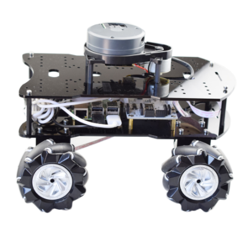
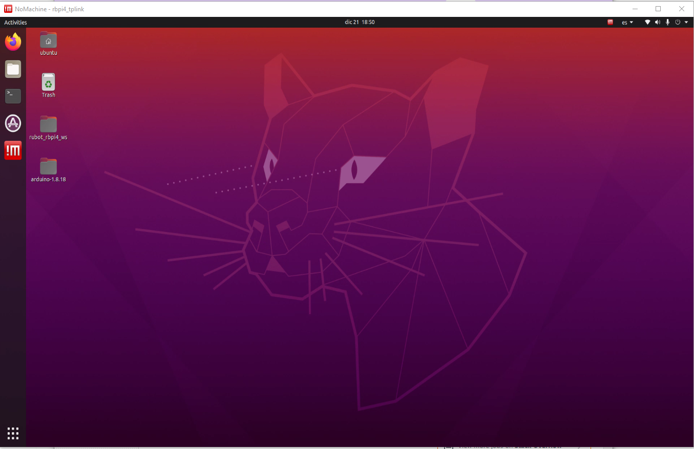
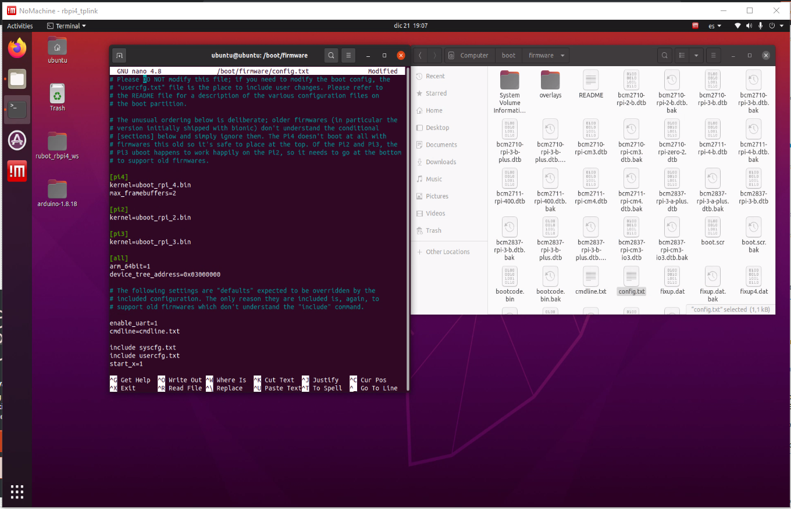
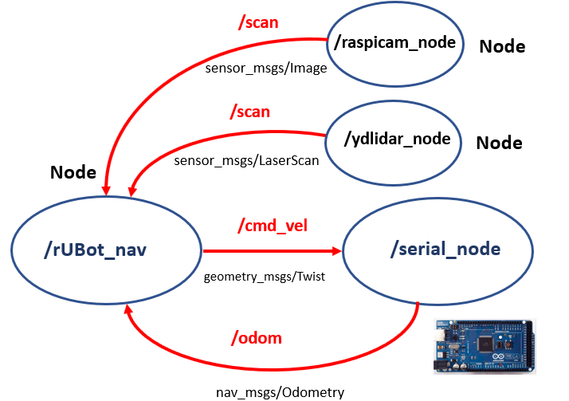
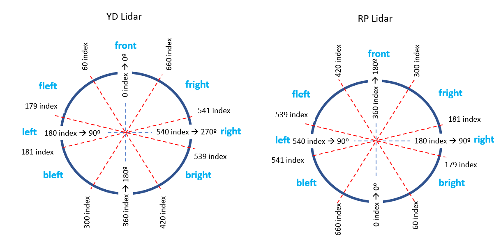

# **rUBot mecanum in Raspberrypi4 Setup&Control**

The main objectives are:
- Assemble a real robot (rUBot mecanum)
- Setup the HW drivers in raspberrypi4
- Control the rUBot movement


Let's see how to fulfill these objectives

References:
- https://github.com/ros-mobile-robots/diffbot

## **1. rUBot assembling**

This tobot prototype is based on:
- Mecanum wheel chasis:
- On-board Raspberrypi4
- Arduino mega: for HW driver control
- Arduino motor driver shield TB6612FNG:
  - https://es.aliexpress.com/item/4001086592215.html?spm=a2g0o.productlist.0.0.55da155eRs0f1N&algo_pvid=523f34f9-da3e-4a7e-bcbd-927dc560fb14&algo_exp_id=523f34f9-da3e-4a7e-bcbd-927dc560fb14-40
  - https://github.com/Seeed-Studio/Grove_Motor_Driver_TB6612FNG
- RaspiCAM RGB camera
- rpLIDAR sensor



## **2. Setup the HW drivers in raspberrypi4**
The raspberrypi4 onboard is preinstalled with:
- Ubuntu 20 server 32bits
  - NoMachine remote desktop
- ROS Noetic
- rubot_rbpi4_ws repository is located in /home/pi/Desktop folder 

### **2.1. Install Ubuntu 20 server 32bits**

Follow the steps in order to properly install the Raspberrypi:

- Install Raspberry Pi OS using Raspberry Pi Imager (download for windows): https://www.raspberrypi.org/software/
- Run the application and save the image:
  - Ubuntu --> Ubuntu 20 server 64bits to the SD card


- Insert the SD in a RBPi board and connect it to screen and ethernet cable to the router
- power the raspberrypi4 and login:
  - login: ubuntu
  - password: ubuntu
- You will have to change the password (we use ubuntu1234)

**Install Ubuntu Desktop**

In the terminal, type:
```shell
sudo apt-get install ubuntu-desktop
```
After some minutes, the desktop is installed. 

Type:
```shell
reboot
```
You will get the ubuntu 20 desktop

- choose a wifi network and change the timezone, language and password

**Install nomachine remote desktop**

Download nomachine in RaspberryPi and PC:
- In raspberryPi:
  - Download the version ARMv8 DEB in: https://www.nomachine.com/download/linux&id=29&s=Raspberry
  - open a terminal and install following the instructions
- In PC: https://www.nomachine.com/

**Notebook visualization in raspberrypi**

Use the NBviewer program from Jupyter:

https://nbviewer.ipython.org/

### **2.2. ROS Noetic Desktop installation**

Follow the instructions on: http://wiki.ros.org/noetic/Installation/Ubuntu
> Is recommended to upgrade first:
```shell
sudo apt upgrade
```
### **2.3. Create WiFi Hotspot and setup**

Follow instructions in: https://www.debugpoint.com/2020/04/how-to-create-wifi-hotspot-in-ubuntu-20-04-lts/


>Carefull!:
>- If "Turn On Wi-Fi Hotspot is disabled select another setting (i.e. Bluetooth) and come back to Wi-Fi setting
>- Choose a SSID corresponding to your robot name

To select this Hotspot automatically on restart:
- open a terminal and see all the connection names:
```shell
nmcli con show
```
- Make the connection "Hotspot" start automatically:
```shell
nmcli con mod Hotspot connection.autoconnect yes
``` 
- Verify listing all the Hotspot parameters including "autoconnect"
```shell
nmcli con show Hotspot
```
- Identify the IP of the rbpi4 Hotspot:
  - type ifconfig
  - in wlan0 you identify the inet address: 10.42.0.1

**Setup**

The raspberrypi4 is configured:
- to generate a hotspot "rUBot_xx"
- NoMachine activated 
- raspicam activated 

When powering the raspberrypi3, generates a hotspot you have to connect to:
- SSID name: rUBot_01 
- password "rUBot_Mec"

Once you are connected to this network you will be able to connect your computer to the raspberrypi4 using NoMachine viewer:
- In PC open NoMachine viewer
- Select the raspberrypi IP address: 10.42.0.1
- you have to specify:
    - user: ubuntu
    - password: ubuntu1234
- You will have the raspberrypi4 desktop on your windows NoMachine screen



If you want to change the Hotspot name (one for each robot):
- Change the Hotspot settings (name or password):
```shell
sudo nm-connection-editor
```

### **2.4. Create your workspace**

We will create the workspace where we will install all needed packages for our Hardware project
```shell
mkdir -p ~/Desktop/rubot_rbpi4_ws/src
cd ~/Desktop/rubot_rbpi4_ws/
catkin_make
echo "source ~/Desktop/rubot_rbpi4_ws/devel/setup.bash" >> ~/.bashrc
```
We will install:
- Raspberrypi camera
- rpLIDAR
- Arduino board with rosserial
### **Install raspberrypi camera**
You need to activate the raspicam in Ubuntu:
- open the file config.txt
```shell
sudo nano /boot/firmware/config.txt
```
- add the magic line start_x=1 at the end


- reboot
- update your system to install the necessary drivers:
```shell
sudo apt update
sudo apt upgrade
```
Now we will install the python module for picamera:
```shell
sudo apt install python3-pip
pip install picamera
```
And the needed libraries for raspicam package:
```shell
sudo apt-get install -y libyaml-cpp-dev
sudo apt-get install -y libogg-dev libvorbis-dev libtheora-dev
```
Finally to work with raspicam in ROS, you need to install the packages:
```shell
git clone https://github.com/UbiquityRobotics/raspicam_node.git
git clone --single-branch --branch=noetic-devel https://github.com/ros-perception/image_transport_plugins.git
git clone --single-branch --branch=noetic https://github.com/ros-perception/vision_opencv.git
git clone --single-branch --branch=noetic-devel https://github.com/ros-perception/image_common.git
```
Some dependencies have to be added.

Follow raspicam_node --> Build Instructions in: https://github.com/UbiquityRobotics/raspicam_node

Then you are able to compile the workspace:
```shell
cd ~/Desktop/rubot_rbpi4_ws/
catkin_make
```

### **Install rpLIDAR**

Open a terminal in src folder and type:
```shell
cd ~/Desktop/rubot_rbpi4_ws/src
git clone https://github.com/Slamtec/rplidar_ros
cd ..
catkin_make
```
To test the sensor, connect the LIDAR sensor to RB Pi and execute:
```shell
roslaunch rplidar_ros view_rplidar.launch
```
### **Install ARDUINO**

This robot will be controlled by an Arduino Mega board.

The arduino program will start a serial_node with all the topics

The Arduino programm is located in "files/Arduino_node" folder.

Considering your Raspberry computer uses Ubuntu 20, as explained in previous sections, you need to download Arduino IDE version for Linux ARM 64 bits from the following link: https://www.arduino.cc/en/software.

After dowloading the zip file, reclocate it and unzip it in the Tools folder: ~/Tools/Arduino-1.8.18. From this directory, open a terminal and execute the following commands:

```shell
sudo ./install.sh
cd ~
gedit .bashrc
export PATH=$PATH:$HOME/Desktop/Arduino-1.8.18
```
Save and close the file and install rosserial for ROS Noetic using:
```shell
sudo apt-get install ros-noetic-rosserial-arduino
sudo apt-get install ros-noetic-rosserial
```
Go to ~/Desktop/Arduino-1.8.18/libraries directory and remove ros_lib folder. From this directory execute:
```shell
rosrun rosserial_arduino make_libraries.py .
```

Test Arduino ROS library with "Hello World" exemple: http://wiki.ros.org/rosserial_arduino/Tutorials/Hello%20World

### **Manage USB ports**

The rbpi4 manage arduino board and rpLIDAR with 2 USB ports. 

We have to force the same USB port to the same device:
- "arduino" port to arduino mega board
- "rplidar" port to rpLIDAR

This can be done creating UDEV rules for each devide:

**a) Arduino udev rules**

Follow instructions: 
- https://steve.fi/hardware/arduino-basics/
- https://medium.com/@darshankt/setting-up-the-udev-rules-for-connecting-multiple-external-devices-through-usb-in-linux-28c110cf9251

  Connect the Arduino Mega in USB port. To see the port name type:
  ```shell
  ls -l /dev/ttyAMC*
  ```
  Give permissions rwx to this port ttyACM*
  ```shell
  sudo chmod 777 /dev/ttyACM*
  ```
  To see the needed properties to create udev rules, type:
  ```shell
  lusb
  ```
  You will see:
  ```shell
  ubuntu@ubuntu:/usr/lib/udev/rules.d$ lsusb
  Bus 002 Device 001: ID 1d6b:0003 Linux Foundation 3.0 root hub
  Bus 001 Device 007: ID 2341:0042 Arduino SA Mega 2560 R3 (CDC ACM)
  Bus 001 Device 004: ID 0e8f:00fb GreenAsia Inc. 
  Bus 001 Device 003: ID 04d9:a01c Holtek Semiconductor, Inc. wireless multimedia keyboard with trackball [Trust ADURA 17911]
  Bus 001 Device 002: ID 2109:3431 VIA Labs, Inc. Hub
  Bus 001 Device 001: ID 1d6b:0002 Linux Foundation 2.0 root hub
  ```
  The create a file /etc/udev/rules.d/99-arduino.rules and give it the following contents:
  ```xml
  # Arduino port definition
  SUBSYSTEM=="tty", GROUP="plugdev", MODE="0660"

  ACTION=="add", SUBSYSTEMS=="usb", ATTRS{idVendor}=="2341", ATTRS{idProduct}=="0042", SYMLINK+="arduino"
  ```
  >The idProduct and idVendor corresponds to the numbers in the Arduino line.

  Now restart the service:
  ```shell
  sudo /etc/init.d/udev restart 
  ```
  Unplug and plug again the Arduino Board and verify if the symlink is created:
  ```shell
  ls -l /dev/arduino /dev/ttyACM0
  ```
  If all is OK, you will see:
  ```shell
  lrwxrwxrwx 1 root root         7 dic 23 08:58 /dev/arduino -> ttyACM0
  crw-rw---- 1 root plugdev 166, 0 dic 23 08:58 /dev/ttyACM0
  ```

**b) rpLIDAR udev rules**

Follow instructions:  
- https://github.com/Slamtec/rplidar_ros/tree/master/scripts

  Connect the rpLIDAR in USB port. To see the port name type:
  ```shell
  ls -l /dev/ttyUSB*
  ```
  Give permissions rwx to this port ttyUSB*
  ```shell
  sudo chmod 777 /dev/ttyACM*
  ```
  To see the needed properties to create udev rules, type:
  ```shell
  lusb
  ```
  You will see your rpLIDAR device properties:
  ```shell
  Bus 001 Device 010: ID 10c4:ea60 Silicon Labs CP210x UART Bridge
  ```
  The create a file /etc/udev/rules.d/rplidar.rules and give it the following contents:
  ```xml
  # set the udev rule , make the device_port be fixed by rplidar
  #
  KERNEL=="ttyUSB*", ATTRS{idVendor}=="10c4", ATTRS{idProduct}=="ea60", MODE:="0777", SYMLINK+="rplidar"
  ```
  Now restart the service:
  ```shell
  sudo /etc/init.d/udev restart 
  ```
  Unplug and plug again the Arduino Board and verify if the symlink is created:
  ```shell
  ls -l /dev/arduino /dev/ttyACM0 /dev/rplidar /dev/ttyUSB0
  ```
  If all is OK, you will see:
  ```shell
  lrwxrwxrwx 1 root root         7 dic 23 09:31 /dev/arduino -> ttyACM0
  lrwxrwxrwx 1 root root         7 dic 23 09:31 /dev/rplidar -> ttyUSB0
  crw-rw---- 1 root plugdev 166, 0 dic 23 09:31 /dev/ttyACM0
  crwxrwxrwx 1 root plugdev 188, 0 dic 23 09:31 /dev/ttyUSB0
  ```

You have now your rUBot_mecanum ready to work-with!!

### **Setup your workspace**

If you do not have the "rubot_rbpi4_ws" folder in your desktop, you can "transfer" folder from your PC (it takes 30s)

The first time you copy the folder, you need to compile the workspace:
- open a terminal in the ws
- type "catkin_make" (it takes 10min)

>Carefull!: Some actions have to be done:
>- review the ~/.bashrc: source to the ws and delete the environment variables
>- make executable the c++ and python files

## **3. rUBot_mecanum first control movements**
First, let's control the rUBot_mecanum movement to perform:
- movement control using keyboard
- movement control with specific python script
- autonomous navigation
- autonomous navigation following right or left wall
- Navigation to speciffic POSE

We will create a "rubot_control" package to perform the rUBot_mecanum control movements:
```shell
cd ~/Desktop/rubot_rbpi4_ws/src
catkin_create_pkg rubot_control rospy std_msgs sensor_msgs geometry_msgs nav_msgs
cd ..
catkin_make
```
First of all you need to bringup the rubot_mecanum robot.

### **3.1. Bringup rubot_mecanum**

The bringup consists to:
- launch the rUBot node in Arduino-Mega board
- launch the LIDAR node
- launch the raspicam node

**Launch rUBot node**

To bringup we need to run the driver designed for rubot_mecanum robot. The driver is in fact an arduino program that controls:
- The kinematics of the 4 mecanum wheels to apply the twist message in /cmd_vel topic
- The encoders to obtain the odometry
- Read the IMU orientation values
- interface with all the other sensors/actuators connected to arduino-mega board

The "rubot_mecanum.ino" arduino program is located on /Documentation/files/arduino/ folder

>Carefull!:
>
>You need to install Encoder.h lib: https://www.arduino.cc/reference/en/libraries/encoder/

To bringup your rubot_mecanum:
- open arduino IDE
- upload the rubot_mecanum.ino file
- Open 3 new terminals and type:
```shell
roscore
rosrun rosserial_python serial_node.py _port:=/dev/arduino _baud:=57600
rostopic pub /cmd_vel geometry_msgs/Twist -r 10 -- '[0.5, 0.0, 0.0]' '[0.0, 0.0, 0.0]'
```
> /dev/arduino is the port to which the Arduino is connected, change it in case yours is different

> The last command sends a Twist message to the robot. The wheels should be moving forward. You can try different movements by modifying the numbers inside the brackets: '[vx, vy, vz]' '[wx, wy, wz]', you should only change vx, vy and wz values as the others do not apply. As it is an holonomic robot, if all the values are 0.0 except for wz (angular velocity in z axis) you will obtain a movement in which the robot spins on itself.

**Launch LIDAR node**

To launch the rpLIDAR sensor, connect the LIDAR sensor to RaspberryPi and execute:
```shell
roslaunch rplidar_ros rplidar.launch
```
**Launch raspicam node**

To launch the raspicam sensor, execute:
```shell
roslaunch raspicam_node camerav2_410x308_30fps.launch enable_raw:=true camera_frame_id:="laser_frame"
```
> Change the launch file for image resolution and frame rate

**Final bringup launch file**

We will create a "rubot_bringup.launch" file to setup the rUBot_mecanum.
```xml
<launch>
 <!-- launch rUBot mecanum   -->
  <node name="serial_node" pkg="rosserial_python" type="serial_node.py">
    <param name="port" type="string" value="/dev/arduino"/>
    <param name="baud" type="int" value="57600"/>
  </node>
 <!-- launch ydlidar   -->
  <include file="$(find rplidar_ros)/launch/rplidar.launch"/>
  <!-- launch raspicam   -->
  <include file="$(find raspicam_node)/launch/camerav2_410x308_30fps.launch">
	<arg name="enable_raw" value="true"/>
	<arg name="camera_frame_id" value="base_scan"/>
  </include>
</launch>
```

### **3.2. Movement control using keyboard**

To control the gopigo robot with keyboard, we need to install "teleop_tools" package. Open a new terminal and install the packages:
```shell
sudo apt-get install ros-noetic-teleop-tools
sudo apt-get install ros-noetic-teleop-twist-keyboard
```
Proceed with:
- Bringup rUBot_mecanum
```shell
roslaunch rubot_control rubot_bringup.launch
```
- Then open a new terminal and type:
```shell
rosrun key_teleop key_teleop.py /key_vel:=/cmd_vel
or
rosrun teleop_twist_keyboard teleop_twist_keyboard.py
```

### **3.3. Movement control with python script**

From the "rubot_rbpi4_ws" workspace, the src/rubot_control folder has 2 new folders:
- scrip folder: with the python programs for specific movement control
- launch folder: with programs to launch the movement control

Diferent navigation programs are created:

- Navigation control: to define a desired robot velocity
- Lidar test: to verify the LIDAR readings and angles
- Autonomous navigation: to perform a simple algorithm for navigation with obstacle avoidance using the LIDAR
- Wall follower: at a fixed distance to perform a good map
- go to POSE: attend a specific position and orientation

The nodes and topics structure corresponds to the following picture:


### **a) Navigation control**

We have created a first navigation python files in "src" folder:

- rubot_nav.py: to define a rubot movement with linear and angular speed to reach a maximum x-distance
- rubot_nav1.py: to define the movement with vx, vy and w to reach a maximum distance in x or y

A "rubot_nav.launch" and "rubot_nav1.launch" files have been created to launch the node and python file created above.

To properly perform a especific movement control we have first to:
- Bringup rUBot_mecanum
```shell
roslaunch rubot_control rubot_bringup.launch
```
- Then open a new terminal to launch the rUBot_nav node to perform the specific movement control.
```shell
roslaunch rubot_control rubot_nav.launch
```

### **b) LIDAR test**

In order to navigate autonomously and avoid obstacles, we will use a specific rpLIDAR sensor. To verify the LIDAR readings and angles we have generated the "rubot_lidar_test.py" python file:

To properly perform a especific movement control we have first to:
- Bringup rUBot_mecanum
```shell
roslaunch rubot_control rubot_bringup.launch
```
- Then open a new terminal to launch the rUBot_nav node to perform the rpLIDAR test. We have created specific python file and launch file for this test control
```shell
roslaunch rubot_control rubot_lidar_test.launch
rosrun teleop_twist_keyboard teleop_twist_keyboard.py
```

### **c) Autonomous navigation and obstacle avoidance**

Using rpLIDAR sensor you can perform the autonomous navigation avoiding obstacles.

This performance is defined in "rubot_self_nav.py"

To properly perform a especific self-navigation control we have first to:
- Bringup rUBot_mecanum
```shell
roslaunch rubot_control rubot_bringup.launch
```
- Then open a new terminal to launch the rUBot_nav node to perform the self-navigation. We have created specific python file and launch file for this navigation control
```shell
roslaunch rubot_control rubot_self_nav.launch
```
The launch file contains some parameters you can modify:
```xml
<launch>
  <!-- launch obstacle avoidance   -->
    <arg name="distance_laser" default="0.3" />
    <arg name="speed_factor" default="0.1"/>
    <arg name="forward_speed" default="2" />
    <arg name="backward_speed" default="-1" />
    <arg name="rotation_speed" default="20" />
    <node name="rubot_nav" pkg="rubot_control" type="rubot_self_nav.py" output="screen" >
        <param name="distance_laser" value="$(arg distance_laser)"/>
        <param name="speed_factor" value="$(arg speed_factor)"/>
        <param name="forward_speed" value="$(arg forward_speed)"/>
        <param name="backward_speed" value="$(arg backward_speed)"/>
        <param name="rotation_speed" value="$(arg rotation_speed)"/>
    </node>    
</launch>
```
In order to see the rubot with the topics information we will use rviz. Open rviz in a new terminal.

In rviz, select the fixed frame to "base_scan", and add Camera and LaserScan with the corresponding topics names.

You can then save the config file as laserscan.rviz name and use it in the launch file


A launch file is created to integrate all the needed roslaunch parameters but you can change the defauld values with this syntax:
```shell
roslaunch rubot_control rubot_self_nav.launch distance_laser:=0.2 speed_factor:=1.3
```
### **D) Wall Follower**

This control task consist on find a wall and follow it at a certain distance. We will see that this is an important control task because this will be used later to make accurate maps of working environments.

We have developed 2 different methods for wall follower:
- Geometrical method
- Lidar ranges method

#### **Geometrical method**
In src folder you create the python file for wall follower purposes

The instructions to perform the python program are in the notebook: 

https://github.com/Albert-Alvarez/ros-gopigo3/blob/lab-sessions/develop/ROS%20con%20GoPiGo3%20-%20S4.md


To properly perform a especific self-navigation control we have first to:
- Bringup rUBot_mecanum
```shell
roslaunch rubot_control rubot_bringup.launch
```
- Then open a new terminal to launch the rUBot_nav node to perform the wall-follower. We have created specific python file and launch file for this navigation control
```shell
roslaunch rubot_control rubot_wall_follower_gm.launch
```
The launch file contains different parameters you can modify:
```xml
<launch>
  <!-- launch follow wall   -->
  <arg name="kp" default="5" />
  <arg name="distance_reference" default="0.3" />
  <arg name="lookahead_distance" default="0.4" />
  <arg name="forward_speed" default="0.04" />
  <arg name="theta" default="50.0" />
  <node name="wall_follower_controller" pkg="gopigo_control" type="rubot_wall_follower_gm.py" output="screen" >
    <param name="kp" value="$(arg kp)"/>
    <param name="distance_reference" value="$(arg distance_reference)"/>
    <param name="lookahead_distance" value="$(arg lookahead_distance)"/>
    <param name="forward_speed" value="$(arg forward_speed)"/>
    <param name="theta" value="$(arg theta)"/>
  </node>
</launch>
```
You can see the video result:

[](https://youtu.be/z5sAyiFs-RU)

#### **b) ranges method**
In src folder you create the python file for wall follower purposes

The algorith is based on laser ranges test and depends on the LIDAR type:



Take into account that:
- RP LIDAR has 180º rotation
- YDlidar in front direction has 2 different ranges [660:719] and [0:60]
- YDlidar sends some 0 values due to wrong readings. They have to be changed to high value to be able to take the minimum falue from the desired range.

To properly perform a especific self-navigation control we have first to:
- Bringup rUBot_mecanum
```shell
roslaunch rubot_control rubot_bringup.launch
```
- Then open a new terminal to launch the rUBot_nav node to perform the wall-follower. We have created specific python file and launch file for this navigation control
```shell
roslaunch rubot_control rubot_wall_follower_rg.launch
```
The launch file has no parameters to modify:

```xml
<launch>
  <!-- launch follow wall   -->
  <node name="wall_follow" pkg="gopigo_control" type="rubot_wall_follower_rg.py" output="screen" >
  </node>
</launch>
```
### **E) Go to POSE**

The objective is to program the robot to reach a speciffic target POSE defining:
- x position
- y position
- angle orientation (from 0º to 180º)

To properly perform a especific self-navigation control we have first to:
- Bringup rUBot_mecanum
```shell
roslaunch rubot_control rubot_bringup.launch
```
- Then open a new terminal to launch the rUBot_nav node to perform the go 2 pose control. We have created specific python file and launch file for this navigation control
```shell
roslaunch rubot_control rubot_go2pose.launch
```
The launch file has no parameters to modify:

```xml
<launch>
<!-- run navigation program  -->
    <arg name="x" default="0.7"/>
    <arg name="y" default="0.7"/>
    <arg name="f" default="120"/>
    <node pkg="nexus_control" type="rubot_go2pose.py" name="nexus_control" output="screen" >
      <param name="x" value="$(arg x)"/>
      <param name="y" value="$(arg y)"/>
      <param name="f" value="$(arg f)"/>
    </node>
</launch>
```
