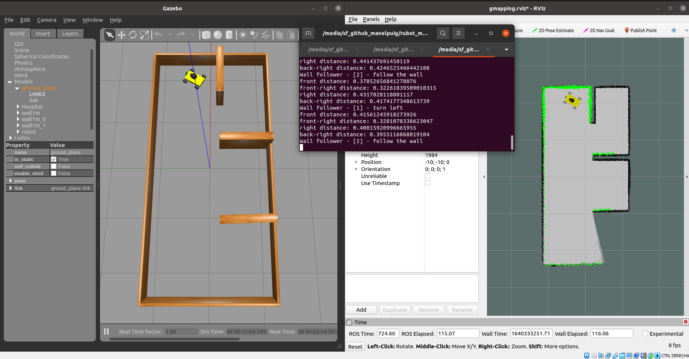
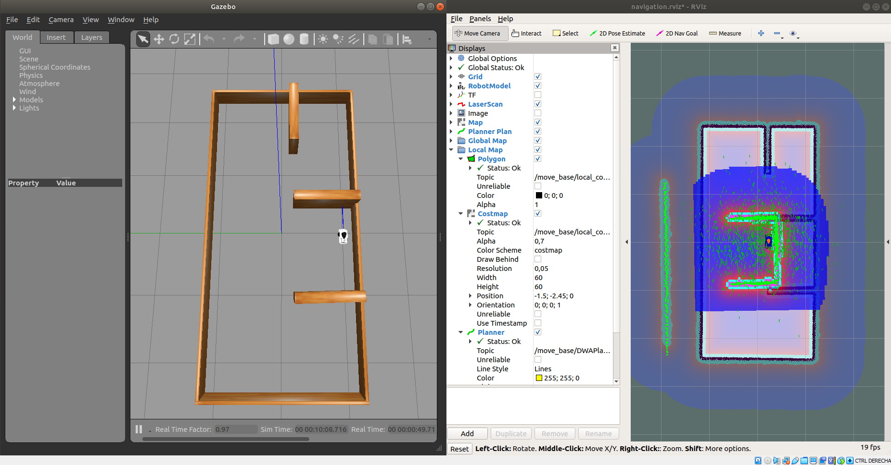
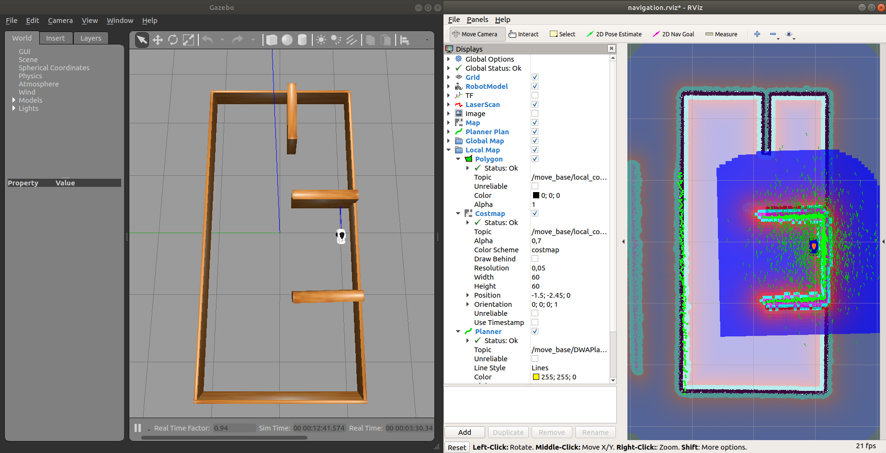
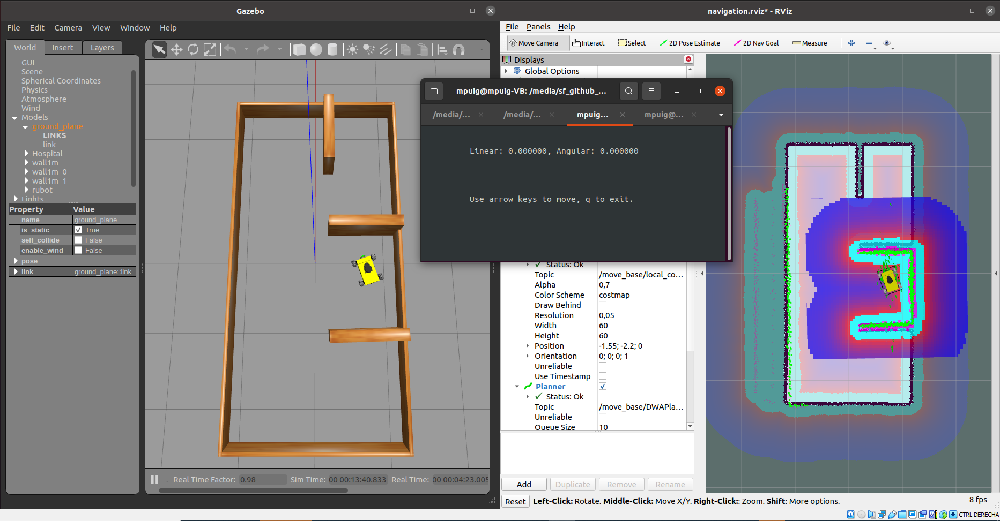

# **rUBot mecanum SLAM & navigation**
Using SLAM (short for Simultaneous Localization and Mapping) techniques, you will be able to execute autonomous navigation with rUBot mecanum.

SLAM is a technique used in robotics to explore and map an unknown environment while estimating the pose of the robot itself. As it moves all around, it will be acquiring structured information of the surroundings by processing the raw data coming from its sensors.

For optimal and easy-to-understand coverage of the topic of SLAM, we will implement a 360º-coverage LIDAR sensor in the virtual robot. 

## **Install ROS navigation & SLAM packages**
First, let's prepare your machine with the required ROS packages needed for the navigation stack (http://wiki.ros.org/navigation):
```shell
sudo apt install ros-noetic-navigation
```
And finally the slam_gmapping package, that is already available in its binary version (https://wiki.ros.org/slam_gmapping)
```shell
sudo apt install ros-noetic-slam-gmapping
```
Open the .bashrc file and verify to source to the proper workspace:
```shell
source /media/sf_github_manelpuig/rUBot_mecanum_ws_/devel/setup.bash
```
> change the path correcponding to your ws
## **What do you need to perform robot navigation with ROS?**
To perform navigation you need:
- Mapping: First, you need a map
- Localization: Next you need to localize the robot on that map
- Path Planning: Now you can send goal locations to the robot
- Obstacle avoidance: Finally, you need to avoid obstacles
## **Navigation with rUBot mecanum in a custom maze**
To navigate with gopigo3 robot in a custom maze we have first to create a virtual_slam package with dependencies:
- roscpp
- rospy
- std_msgs
- sensor_msgs
- geometry_msgs
- nav_msgs

The package "nexus_slam" is already created. Copy this folder to the src directory of your workspace and compile again your repository.

This repository is essentially the one corresponding to turtlebot3 adapted for the nexus robot prototype:

 https://github.com/ROBOTIS-GIT/turtlebot3 

Now you can follow the next steps:
### **1. Spawn the robot in our custom made maze**
We open a new terminal and type:
```shell
roslaunch nexus_slam rubot_world.launch
```
### **2. Generate the MAP**
We will start the slam_gmapping node. This node is highly configurable and has lots of parameters you can change in order to improve the mapping performance. (http://wiki.ros.org/gmapping)

Let's now check some of the most important ones that usually have to be changed:

- base_frame (default: "base_link"): Indicates the name of the frame attached to the mobile base.
- map_update_interval (default: 5.0): Sets the time (in seconds) to wait until update the map. (I take 1s)
- delta (default: 0.05): Sets the resolution of the map (I take 0.01m)


Open the "gmapping.launch" file and change properly the parameters you consider. Then launch the rubot_slam file:
```shell
roslaunch nexus_slam rubot_slam.launch
```
Teleoperate the robot to make it cover as much as possible of the surface of the current Gazebo world. 

Let's do this as usual with the teleoperation package:
```shell
rosrun key_teleop key_teleop.py /key_vel:=/cmd_vel
```
Or use the navigation program you have designed to follow the walls for exemple to properly generate the map.
```shell
roslaunch nexus_control node_wall_follower_gm.launch
```
> Take care to launch only the wall_follower node



[](https://youtu.be/I6WwQv63Txw)


### **3. Open the MAP saver and save the map**
We can open now the map_saver file in map_server package to save the map in the local directory:
```shell
rosrun map_server map_saver -f Hospital3_map
```
The map is generated with two files:
- Hospital3_map.pgm (2D B&W map picture)
- Hospital3_map.yaml (map parameters)


Provided with the map, we are ready to perform robot navigation with the rUBot mecanum.

### **4. Robot Navigation**
When the robot moves around a map, it needs to know which is its POSE within the map.

The AMCL (Adaptive Monte Carlo Localization) package provides the amcl node, which uses the MCL system in order to track the localization of a robot moving in a 2D space. This node subscribes to the data of the laser, the laser-based map, and the transformations of the robot, and publishes its estimated position in the map. 

On startup, the amcl node initializes its particle filter according to the parameters provided.

This AMCL node is also highly customizable and we can configure many parameters in order to improve its performance. (http://wiki.ros.org/amcl)

rUBot mecanum is omni driven robot and has some peculiarities. Interesting information you can found in: 
- https://www.robotshop.com/community/robots/show/autonomous-navigation-mecanum-wheel-robot
- https://answers.ros.org/question/350791/how-can-i-make-my-robot-move-like-a-robot-with-mecanum-wheels/
- https://answers.ros.org/question/227474/navigation-stack-holonomic-true-not-working/

Let's have a look at some of the most important parameters in "amcl.launch" file:

#### **General Parameters**

- odom_model_type (default: "diff"): It puts the odometry model to use. It can be "diff", "omni", "diff-corrected", or "omni-corrected".
- base_frame_id (default: "base_link"): Indicates the frame associated with the robot base.

We can use the nexus robot as a Differential drive robot model without available lateral movements. 

#### **Costmap Parameters**

These parameters will allow you to configure the way that the navigation is performed and are located in "costmap_common_params.yaml" file:
- footprint: dimensions of the base_footprint for colision information
- Inflation radius: increase dimensions of obstacles to prevent colisions
- cost scaling factor: to define allowed regions among obstacles to define the optimal trajectory.


Review these parameters in "costmap_common_params.yaml"
```python
obstacle_range: 3.0
raytrace_range: 3.5

#robot_gopigo
#footprint: [[-0.17, -0.06], [-0.17, 0.06], [0.09, 0.06], [0.09, -0.06]]
#robot_nexus
footprint: [[-0.22, -0.16], [-0.22, 0.16], [0.22, 0.16], [0.22, -0.16]]

inflation_radius: 1.0
cost_scaling_factor: 5.0

map_type: costmap
observation_sources: scan
scan: {sensor_frame: base_scan, data_type: LaserScan, topic: scan, marking: true, clearing: true}
```

You can refine some parameters considering the recommendations in:
https://emanual.robotis.com/docs/en/platform/turtlebot3/navigation/#tuning-guide

>Careful!!
>
>global & local_costmap_params.yaml: specify the robot_base_frame as "base_footprint" link according to the URDF file. This link is the first one and has TF connection to the world

So, basically, we have to do the following:

- Open the nexus robot in Hospital3 world (if you have closed it before)
```shell
roslaunch nexus_slam rubot_world.launch
```

- Open Navigation launch file including the map location:
```shell
roslaunch nexus_slam rubot_navigation.launch
```
> Take care in launch file to read the correct map file in "maps" folder


- set up an initial pose by using the 2D Pose Estimate tool (which published that pose to the /initialpose topic).



- To obtain a proper localisation of your robot, move it right and left using the key_teleop.
```shell
rosrun key_teleop key_teleop.py /key_vel:=/cmd_vel
```



- Select the target goal to navigate with the tool "2D-Nav-Goal"


You can see some videos of Navigation process inside Hospital plant:

[](https://youtu.be/my33X_qWsjY)

[](https://youtu.be/r92mEQ9JAL8)

The movement is more complicate in the small room! the mobility is limited to forward and rotations. Sometimes the target navigation pose is not feasible like in the following exemple:


Using "omni" drive performances, the robot is able to move also in y direction and the mobility is much better.

You need to modify the "dwa_local_planner_params_burger.yaml parameters. An exemple of possible parameters set is:

```xml
DWAPlannerROS:

  holonomic_robot: true           #false
# Robot Configuration Parameters  Defaults
  max_vel_x: 1                    #0.22
  min_vel_x: -1                   #-0.22

  max_vel_y: 0.5                    #0.0
  min_vel_y: -0.5                   #0.0

# The velocity when robot is moving in a straight line
  max_vel_trans:  1               #0.22
  min_vel_trans:  0.2             #0.11

  max_vel_theta: 1              #2.75
  min_vel_theta: -1              #1.37

  acc_lim_x: 2.5
  acc_lim_y: 0.5                  #0.0
  acc_lim_theta: 3.0              #3.2 

# Goal Tolerance Parametes
  xy_goal_tolerance: 0.1          #0.05
  yaw_goal_tolerance: 0.1         #0.17
  latch_xy_goal_tolerance: false

# Forward Simulation Parameters
  sim_time: 1.5
  vx_samples: 20
  vy_samples: 20                  #0
  vth_samples: 40
  controller_frequency: 5.0      #10.0

# Trajectory Scoring Parameters
  path_distance_bias: 32.0
  goal_distance_bias: 20.0
  occdist_scale: 0.02
  forward_point_distance: 0.325
  stop_time_buffer: 0.2
  scaling_speed: 0.25
  max_scaling_factor: 0.2

# Oscillation Prevention Parameters
  oscillation_reset_dist: 0.05

# Debugging
  publish_traj_pc : true
  publish_cost_grid_pc: true
```
In that case you can see a very good and fast mobility!!!
